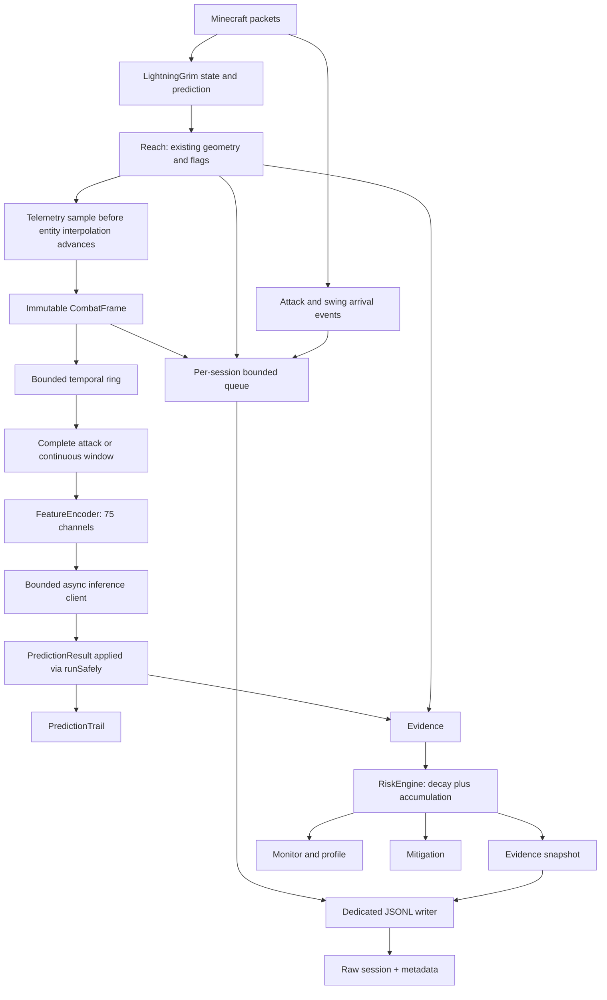

# Aero AC — архитектура neural модуля

Гибридный анticheat поверх существующего LightningGrim: deterministic/predictive проверки
остаются ответственными за всё, что определяется математически достоверно, а ML-часть
занимается поведением, которое технически находится в допустимых пределах Minecraft, но
статистически похоже на автоматизацию.

Реализованы все шесть фаз: сбор телеметрии и датасетов, Python-пайплайн, temporal модель,
асинхронный inference, накопительный Risk Engine и server-authoritative mitigation.
**Каждая стадия выключена по умолчанию и включается отдельным флагом.** Ни одна из них не
изменяет поведение существующих проверок, их violations, alerts и punishments.

Bukkit plugin id — `AeroAC`, активная папка данных — `plugins/AeroAC`, права `grim.*` сохранены
для совместимости. При обновлении с прежних сборок содержимое `plugins/GrimAC` один раз
копируется в активную папку до первого чтения конфигурации (см. [dataset.md](dataset.md));
существующий `config.yml` в активной папке никогда не перезаписывается.

| Фаза | Что делает | Конфиг | Документ |
| --- | --- | --- | --- |
| 1 | Телеметрия и запись датасетов | `neural.collection.enabled` | [dataset.md](dataset.md) |
| 2 | Python loader, окна, splits, normalization | — | [ml/README.md](../ml/README.md) |
| 3 | Temporal модель, evaluation, calibration, ONNX | — | [ml/README.md](../ml/README.md) |
| 4 | Async inference, PredictionTrail, monitor | `neural.inference.enabled` | [inference.md](inference.md) |
| 5 | Evidence, PlayerRiskProfile, RiskEngine, снимки | `neural.risk.enabled` | [risk-and-mitigation.md](risk-and-mitigation.md) |
| 6 | Mitigation | `neural.mitigation.enabled` | [risk-and-mitigation.md](risk-and-mitigation.md) |
| — | Сбор реального датасета и допуск модели | — | [data-collection-protocol.md](data-collection-protocol.md), [model-promotion.md](model-promotion.md) |

## Разделение ответственности

Grim отвечает за достоверно вычислимое: movement prediction, reach, velocity, timer, WallHit,
EntityPierce, PacketOrder, невозможные движения и невозможную геометрию атаки. Это не изменено
и не продублировано: neural модуль не выполняет ни одного нового raycast, физического расчёта
или latency compensation.

ML отвечает за AimAssist, KillAura с legit rotations, rotation assist, TriggerBot, target
tracking, pre-attack corrections и слабые адаптивные combat assists — то, что не нарушает
правил игры, но отличается статистически.

## Анализ существующей архитектуры и точки интеграции

Исследована локальная копия Aero AC, основанная на
[LightningGrim](https://github.com/Axionize/LightningGrim). В этой папке изначально
нет `.git`, поэтому точный upstream commit локального дерева неизвестен.

Все пути Java ниже относительны `common/src/main/java/dev/aeroac/`.

| Компонент | Что уже делает | Использование Phase 1 |
| --- | --- | --- |
| `player/AeroPlayer` | Per-user состояние, pose, координаты, rotations, prediction velocity, transaction RTT | Одно поле `NeuralPlayerState`; без десятков новых полей на игроке |
| `manager/init/start/PacketManager` | Регистрация PacketEvents listeners | Новый отдельный packet listener не нужен |
| `events/packets/CheckManagerListener` | Clamp позиции, teleport acceptance, 1.17 duplicate filtering, pre-prediction, rotation/position updates | Только marker для отменённого pre-prediction movement |
| `manager/CheckManager` | Ordered dispatch checks | Frame hook перед `PacketEntityReplication`; attack/swing hook после обычных packet checks |
| `events/packets/PacketPlayerAttack` | `ATTACK` и legacy `INTERACT_ENTITY.ATTACK`, cooldown, sprint attack slowdown | Изучен, его обработка/physics не меняются |
| `predictionengine/MovementCheckRunner` | Запуск prediction через position updates, post-prediction callbacks | Уже рассчитанное `clientVelocity`; новый predictor не нужен |
| `events/packets/PacketEntityReplication` | Transaction-aware spawn/move/remove, interpolation advancement | Не изменён; используется существующий критерий `isTickPacket()` |
| `utils/latency/CompensatedEntities`, `PacketEntity` | Видимые клиенту сущности и возможные collision boxes | Цель из `entityMap`, box из `getPossibleCollisionBoxes()` |
| `utils/latency/CompensatedWorld` и world readers | Реплика блоков, updates с latency compensation | LOS только из уже выполненного Reach/WorldRayTrace |
| `utils/latency/LatencyUtils`, `PacketPingListener`, `AeroPlayer` | Применение transaction tasks в event loop, RTT | Готовый transaction ping и transaction ID; compensation не дублируется |
| `utils/nmsutil/ReachUtils`, `WorldRayTrace` | Intercepts, возможные направления, block/entity occlusion | Существующие Reach результаты; новых raycasts нет |
| `utils/math/VectorUtils.cutBoxToVector` | Ближайшая точка AABB к указанной позиции | Выбор ближайшей точки compensated hitbox к глазам |
| `checks/impl/combat/Reach` | Очередь взаимодействий, range/margin, многолучевая проверка; флаги Reach/WallHit/EntityPierce | Один observer hook после готовой геометрии, до классификации результата |
| `checks/impl/combat/WallHit`, `EntityPierce` | Самостоятельные check identities, нарушения выставляет Reach | Не изменены |
| `checks/impl/packetorder/PacketOrderProcessor`, `PacketOrderA..P` | Порядок действий, version-specific buffers | Только фактически принятые flags как raw evidence |
| `checks/Check`, `PunishmentManager`, `AlertManagerImpl` | Flag event, violation accounting, alerts, punishments | Observer после uncancelled flag event; ни одного ML flag/punishment |
| `AeroAPI`, `InitManager`, `AeroExternalAPI` | Start/stop/reload | Lifecycle recorder, закрытие записей при reload |
| `utils/anticheat/PlayerDataManager` | Add/remove/disconnect cleanup | Закрытие записи и отмена незавершённого открытия |
| `events/packets/PacketPlayerRespawn` | Transaction-synchronized respawn/world reset | Segment marker внутри существующей transaction task |
| `manager/TickManager`, `TickRunner` | Platform-aware tick scheduling | Измерение интервала callback, volatile snapshot для packet threads |
| `command/CloudCommandService` | Общая регистрация Cloud команд на Bukkit/Fabric | Регистрация `NeuralCommand` |

`Reach` расположен перед `PacketEntityReplication` в `packetChecks`. Кадр снимается
между ними, пока box цели ещё находится в той же фазе интерполяции, что и Reach.
Запись attack/swing после проверки сохраняет cancellation на этом участке pipeline;
это не финальный вердикт всех сторонних PacketEvents listeners и не подтверждение урона.
PacketOrder flags, пришедшие после sample hook, попадают в следующий frame interval;
их отдельные timestamped events сохраняют точное наблюдаемое время.

## Сравнение с Shard

Изучен [Shard commit 41181121fd563b36427116422185301f76b6dcf4](https://github.com/KaelusAI/Shard/tree/41181121fd563b36427116422185301f76b6dcf4).
Код Shard не переносился в Aero AC.

* [AiCheck](https://github.com/KaelusAI/Shard/blob/41181121fd563b36427116422185301f76b6dcf4/src/main/kotlin/ac/shard/checks/impl/ai/AiCheck.kt)
  фильтрует flying ticks, накапливает yaw/pitch sequence, делает async request,
  возвращает response через player scheduler. Его buffer растёт/уменьшается по
  вероятности, отдельно вызываются mitigation scorer и damage processor.
* [TickRingBuffer](https://github.com/KaelusAI/Shard/blob/41181121fd563b36427116422185301f76b6dcf4/src/main/kotlin/ac/shard/checks/impl/ai/TickRingBuffer.kt)
  хранит два float на tick, поддерживает stride и primitive snapshot. В Aero AC
  raw frame гораздо шире; ring хранит ссылки на immutable frames, без копирования
  перекрывающихся attack windows при каждом ударе.
* [TickData](https://github.com/KaelusAI/Shard/blob/41181121fd563b36427116422185301f76b6dcf4/src/main/kotlin/ac/shard/data/TickData.kt)
  записывает deltaYaw/deltaPitch в CSV.
  [DataSession](https://github.com/KaelusAI/Shard/blob/41181121fd563b36427116422185301f76b6dcf4/src/main/kotlin/ac/shard/data/DataSession.kt)
  накапливает ConcurrentLinkedQueue всей сессии до сохранения, включает имя игрока
  в имя файла. В Aero AC — bounded queue, потоковая запись, session UUID в имени
  файла, HMAC pseudonym только в metadata, явный UNLABELED.
* [AiService](https://github.com/KaelusAI/Shard/blob/41181121fd563b36427116422185301f76b6dcf4/src/main/kotlin/ac/shard/ai/AiService.kt)
  задаёт async контракт features/count; `DefaultAiService` обрабатывает parsing и
  информацию expected sequence/step. Это референс будущей Phase 4, зависимости
  от сервиса Shard здесь нет.
* [ProbabilityTrail](https://github.com/KaelusAI/Shard/blob/41181121fd563b36427116422185301f76b6dcf4/src/main/kotlin/ac/shard/checks/impl/ai/ProbabilityTrail.kt)
  ограничивает историю квантованными байтами и синхронизирует доступ. История
  вероятностей и [mitigation](https://github.com/KaelusAI/Shard/tree/41181121fd563b36427116422185301f76b6dcf4/src/main/kotlin/ac/shard/mitigation)
  в Phase 1 не создаются.

## Структура реализации

```text
common/src/main/java/dev/aeroac/neural/
  NeuralManager.java        хуки анticheat, lifecycle, ленивое создание collector
  NeuralRuntime.java        всё, чем владеет одна generation конфигурации
  NeuralConfig.java         неизменяемый снимок одной перезагрузки
  NeuralPlayerState.java    единственное новое поле AeroPlayer
  NeuralMessages.java       доставка ответа оператору вне packet-потока
  telemetry/
    FrameField.java             79 raw полей (НЕ список входов модели)
    TelemetryRecord.java, CombatFrame.java, CombatEvent.java, ReachObservation.java
    CombatTelemetryCollector.java
  target/
    TargetTracker.java, AimErrorCalculator.java
  window/
    TemporalRingBuffer.java, AttackWindowBuilder.java
  dataset/
    DatasetMetadata.java, DatasetSession.java, DatasetJson.java, DatasetManager.java
    SnapshotJson.java
  inference/
    ModelFeature.java          75 каналов входа модели
    FeatureEncoder.java        окно кадров -> float[]
    ModelKind.java, ModelWindow.java
    InferenceRequest.java, InferenceResponse.java, PredictionResult.java
    InferenceJson.java, InferenceClient.java, HttpInferenceClient.java
    InferenceHealth.java, InferenceGateway.java, PredictionTrail.java
  risk/
    RiskState.java, EvidenceType.java, Evidence.java
    PlayerRiskProfile.java, RiskEngine.java
    PendingSnapshot.java, EvidenceSnapshot.java
  mitigation/
    MitigationRule.java, MitigationAction.java
    PlayerMitigationState.java, MitigationManager.java
  debug/
    NeuralMonitor.java, NeuralReport.java
  command/NeuralCommand.java
common/src/test/java/dev/aeroac/neural/
  NeuralConfigTest.java, TelemetryFoundationTest.java
  DatasetRecorderTest.java, DatasetExampleTest.java
  FeatureSchemaTest.java, FeatureEncoderGoldenTest.java
  RiskEngineTest.java, InferenceProtocolTest.java, InferenceRequestGoldenTest.java
ml/                        Python: схема, датасет, модель, обучение, экспорт, сервис
docs/neural-architecture.md, dataset.md, inference.md, risk-and-mitigation.md
docs/examples/neural-session/
```

Разделение `NeuralManager` / `NeuralRuntime` существует ради перезагрузки. Runtime владеет
клиентом, RiskEngine, MitigationManager и монитором одной конфигурации и имеет номер generation;
`/aero reload` строит новый и закрывает старый. Collector игрока хранит generation, с которой
был создан, поэтому ответ модели, построенный для прошлой конфигурации (другие размеры окон,
другие пороги), отбрасывается, а не применяется к новой.

## Pipeline и lifecycle CombatFrame



Телеметрия начинается с **первой атаки** игрока и прекращается после
`telemetry.idle-timeout-seconds` без боя. Соединение, которое не дерётся, стоит один пустой
объект состояния: ни кольца, ни кадров, ни выделений на движение. Цена — у самой первой
атаки нет предшествующей истории, поэтому её окно не строится; для целей это ограничение
и так существует (цель известна только после атаки).

1. Запись датасета открывается явной командой. Disk worker создаёт raw file и incomplete
   metadata; сессия присоединяется к уже работающему collector.
2. Attack/swing events накапливают counters до следующего принятого tick и сразу
   передают отдельные immutable events writer-очереди. Время — `System.nanoTime()`.
3. На обычном movement tick используется готовая player state. Для 1.21.2+
   учитывается `CLIENT_TICK_END` без предшествующего movement через существующий
   `Check.isTickPacket()`. Duplicate 1.17 packets и teleport acceptance не становятся
   обычными кадрами; отдельного удвоения tick нет.
4. Reusable scratch array заполняется raw values. На первом кадре segment значения
   производных неизвестны. Delta, acceleration и jerk получают нужный warmup.
5. `CombatFrame` копирует 79 primitive values один раз. Кадр не держит ссылок на
   AeroPlayer, PacketEntity, world, ItemStack или packet wrappers.
6. Ring заменяет старые ссылки, очередь публикует frame disk worker. При заполнении
   очереди offer возвращает false и увеличивает droppedRecords, packet не ждёт.
7. Stop/disconnect/reload прекращают приём. Worker дренирует очередь и атомарно
   заменяет metadata. Shutdown ожидает не более 5 секунд. Авария JVM/диска оставляет
   incomplete session для review; это не транзакционное хранилище с fsync на каждый tick.

Frame tick — локальный индекс принятых samples, не обещание ровно 20 Hz реального
клиента. Поэтому сохраняются реальные интервалы и отдельные timestamps событий.
Attack tick для window builder — первый следующий sample, включающий этот attack.
`AttackWindowBuilder` возвращает окно только при полной истории до/после события,
без пропущенных tick IDs и пересечения segment boundary. Raw сессии не обрезаются
под текущий размер окна.

## Окна и вход модели

Кадр — это 79 raw полей; вход модели — 75 каналов, и это два разных контракта.
Новейший `ml/schema/feature_schema_v*.json` (сейчас v4) канонически задаёт второй: 42 value channels и 33 mask
channels (маски идут после всех значений, в порядке объявления nullable значений).
Java `ModelFeature`/`FeatureEncoder` и Python `encode_window` обязаны совпадать; это удерживают
`FeatureSchemaTest`, `FeatureEncoderGoldenTest` и `ml/tests/test_features.py` через общий
fixture `ml/tests/data/encoder_golden.json`.

Unknown кодируется как `0` с маской `0`. Пара обязательна: сам по себе ноль выглядел бы как
измерение, а модель должна отличать «нет цели» от «точно на цели».

В модель **не** входят username, UUID, псевдоним, entity/transaction/session идентификаторы,
абсолютные координаты, версия протокола, held item и evidence существующих Grim checks.
Последнее — принципиально: если скармливать flags как признаки или как метку, модель выучит
пороги deterministic проверок вместо поведения.

Derived-каналы считаются внутри окна: у индекса 0 нет предшественника в окне, поэтому его
производные unknown. Обе реализации делают одинаково; альтернатива (подтягивать кадр из-за
границы окна) даёт два места для расхождения ради одного сэмпла.

Окна двух типов. Attack: `attack-before` сэмплов, сама атака, `attack-after` — полная история
без дыр и без пересечения границы сегмента, каждая атака предлагается ровно один раз.
Continuous: последние N подряд идущих сэмплов одного сегмента.

## Current target и compensated geometry

Цель выбирается только по явному attack entity ID. Сущность должна находиться в
`compensatedEntities.entityMap`, быть живой living entity, не самим игроком и не
пассажиром. Во время vehicle/blocked teleport цель не используется. Правая кнопка,
ближайший Bukkit entity и взгляд сами по себе не выбирают цель.

TargetTracker проверяет одновременно entity ID и object identity, чтобы despawn +
spawn с тем же ID не продолжали старое tracking. Цель истекает по числу ticks И по
монотонному времени (default 40 ticks / 2 секунды). Смена сущности сбрасывает
производные target displacement/aim error. Respawn/world reset и teleport разделяют
последовательности. Первое приобретение цели отдельно от переключения A → B:
TARGET_PRESENT меняется 0 → 1; TARGET_SWITCH обозначает замену существующей цели.

До первой атаки raw rotations уже записываются, но target-relative features null.
Это ограничение Phase 1: pre-acquisition geometry первой атаки нельзя полностью
восстановить для ещё не отслеживаемой цели. Для последующих атак удерживается текущая
цель. Не следует обучать модель на выдуманной ближайшей цели.

Box — консервативное объединение возможных клиентских interpolated hitboxes,
а не точная server entity location. Все шесть границ сохраняются. `TARGET_X/Z` —
центр этого envelope, `TARGET_Y` — его нижняя грань. TARGET_VELOCITY — изменение
этих оценок между samples в blocks/sample; это не точная физическая скорость.

Aim point выбран существующим `VectorUtils.cutBoxToVector` как ближайшая точка box
к глазам. `atan2(-dx,dz)` и `-atan2(dy,hypot(dx,dz))` дают Minecraft yaw/pitch.
Yaw/error нормализуется в [-180,180). Внутри box направление к ближайшей точке
неопределено, поэтому aim angles/error null. Предположение о точке явно сохраняется
через AIM_POINT и EYE_HEIGHT; будущий pipeline может выбрать другую точку box.

ReachObservation содержит уже рассчитанный minimum ray distance и расширенный
box. Intersection — результат по набору допустимых rays/eye heights Grim; он не
равен точному положению текущего crosshair. Поэтому CROSSHAIR_INSIDE_HITBOX в этой
фазе null. LOS равен 1 только при однозначном попадании существующего world ray
в целевую entity; 0 — при не-exempt блоке, прочие случаи null. Этот LOS относится
к проверенному взаимодействию; он публикуется в кадре только для той же цели и
текущего sample interval. Старое наблюдение не превращается в новый LOS.

SUCCESSFUL_HIT всегда null: attack packet, hurt animation и положительный Reach
не доказывают нанесённый сервером урон. Для достоверного поля нужен будущий
platform-specific authoritative damage observer с корректной отменой событий.

## Threading

| Поток | Владеет/делает | Не делает |
| --- | --- | --- |
| Player Netty event loop | Collector, target tracker, scratch, frame ring, attack/flag events, producer side session queue, кодирование окна, PredictionTrail, RiskEngine, mitigation, решение об отмене атаки | JSON ответа, файлы, HTTP, ожидание futures |
| Dataset disk worker | File open/write/flush/close, JSON encoding сессий и снимков, metadata, consumer queue | Чтение живого AeroPlayer/world/entity |
| Inference client threads | Сборка тела запроса, HTTP exchange, разбор и валидация ответа | Любое чтение или изменение состояния игрока |
| Command/platform thread | Selector/permission, отправка задания через `runSafely` | Прямое чтение ring/target/risk |
| Entity/region scheduler | Отправка текстового ответа администратору и строк монитора | ML state mutation |
| TickManager callback | Замер интервала callback; volatile tick/time publication | Telemetry для всех игроков |

Весь изменяемый ML-state игрока живёт на его event loop. Кросс-поточно читаются только явно
volatile поля: сессия записи, текущее состояние риска, активная mitigation и флаг «за игроком
смотрят». Ни одного `synchronized` на per-tick пути нет.

Результат inference возвращается через `AeroPlayer.runSafely` и принимается только если игрок
ещё подключён, collector не сменился (не было reload) и `requestId` больше последнего
принятого. `PredictionTrail` отбрасывает опоздавшие и дублирующие ответы: поздний ответ не
может перезаписать более новый.

`InferenceGateway` строит запрос и отдаёт клиенту; packet thread не ждёт ничего. Когда предел
`max-in-flight` достигнут, запрос пропускается и считается в `shed` — очередь бы только
удлиняла задержку и всё равно упиралась в timeout.

Mitigation принимает решение на том же event loop, где обрабатывается attack-пакет: телеметрия
записывает пакет в наблюдаемом виде, и только после этого он может быть отменён.

На Folia этот TickRunner callback — async scheduler heartbeat, поэтому его интервал
НЕ является MSPT конкретного региона. Даже на Bukkit это интервал tick callback,
не измерение времени выполнения всей серверной работы. Поле так и интерпретируется.

Queue использует SPSC indices с volatile release/acquire. Atomic in-flight counter
делает остановку безопасной одновременно с offer: writer закрывает файл только
после окончания публикации. Нет synchronized/locks вокруг per-tick collection.
Редкие open/reload/close команды DatasetManager сериализованы. Количество открытий
ограничено до постановки файловой задачи; в executor не отправляется задача на frame.
Ошибки observer закрывают только запись; существующие checks продолжают обработку.

## Память и производительность

При neural disabled, а также для любого игрока вне боя, нет frame/ring/JSON allocations
на движение: collector создаётся только на первой атаке и уничтожается после
`telemetry.idle-timeout-seconds` без боя. На AeroPlayer остаётся небольшой NeuralPlayerState.
На активного бойца: один scratch, ring default 96. На записываемую сессию дополнительно queue
default 256 и один BufferedWriter. Ring и queue разделяют ссылки на одни кадры, а не копируют
object graphs.

Оценка при Java 17/21, compressed oops, 8-byte alignment: frame ~680 bytes
(32-byte object + 648-byte double[79]); 20 samples/s дают ~13.3 KiB/s выделений
на записываемого игрока без учёта событий и работы существующего Grim. Получение
compensated box и ближайшей точки также создаёт небольшие временные объекты.

| Одновременно записываемых игроков | Только кольца с frames | Верхняя оценка ring + полная queue + scratch + writer |
| ---: | ---: | ---: |
| 100 | ~6.3 MiB | ~31 MiB |
| 500 | ~31.3 MiB | ~153 MiB |
| 1000 | ~62.7 MiB | ~306 MiB |

Это расчёт, не измерение JFR и не обещание TPS. Default max-sessions=16 ограничивает
верхнюю оценку recorder примерно 5 MiB даже при 1000 online. Максимум настройки
max-sessions=128; строки 500/1000 показывают гипотетический масштаб при изменении cap.
Фактическое число online не означает, что они все записываются, и с гейтом по бою столбец
«только кольца» относится к числу игроков **в бою одновременно**, а не к online.

Phase 4-6 добавляют: на запрос — один `float[T*63]` (для T=31 это ~7.8 KiB) и его JSON-тело
(~20 KiB текста), оба на короткое время и не чаще `min-interval-ms`; на игрока с предсказаниями —
PredictionTrail на 32 записи, PlayerRiskProfile с кольцом на 64 evidence и история mitigation
на 16 записей. Все три создаются лениво: до первого предсказания и первого evidence их нет.

JSON-тело запроса — самая дорогая часть Phase 4 по трафику и CPU. Это осознанный выбор первой
версии: бинарный формат или gRPC имеет смысл вводить после измерения, а не до него.

Снимки evidence ограничены `max-snapshots-per-hour` на игрока и 64 элементами в очереди
записи; при переполнении снимок отбрасывается и считается, а запись сессий не задерживается.

JSONL с именами 79 полей существенно больше бинарного payload; оценку bytes/sample
можно получить из fixture в docs/examples. Один disk worker может стать bottleneck
при массовой записи или медленном диске. Счётчики droppedRecords обязательны для
контроля качества; лимиты длительности/диска — мягкие: уже принятые записи дренируются
после достижения порога. Сессии с потерями не следует использовать без review.

Проверки: geometry/window/immutability/schema, concurrent queue, disk
lifecycle/error/admission/pseudonym, контракт feature schema и cross-language fixture энкодера,
протокол inference (несовместимые версии, искажённые ответы, timeout, 429, переполненное тело,
shedding), затухание и накопление риска, переходы состояний, правила mitigation, cross-language
fixture запроса. Проверка реального Minecraft/Folia traffic и JFR load profiling должна
выполняться на тестовом сервере до записи эталонных combat sessions и до включения inference.
Юнит-тесты её не заменяют.

## Порядок включения на реальном сервере

Фазы реализованы, но включать их следует по одной, и каждая следующая — только после
измерений на предыдущей.

1. `collection` — записать labeled сессии: сильные честные игроки, крайние sensitivity,
   jitter/butterfly clicking, высокий ping, лаги, разные версии протокола; и отдельно слабые
   конфигурации читов (высокое сглаживание, малый FOV, редкая активация).
2. Python-пайплайн: группировать split минимум по сессии, лучше по игроку, отдельно держать
   unknown-client benchmark. Обучение, calibration, evaluation по TPR@FPR и false positives
   на час честного боя, а не по accuracy.
3. `inference` — только мониторинг. Убедиться, что `rejected` равен нулю, а доля `shed` и
   задержка приемлемы под реальной нагрузкой.
4. `risk` — по-прежнему без наказаний. Наблюдать `/neural profile` на заведомо честных
   сильных игроках; настроить пороги по этим наблюдениям.
5. `mitigation` — последним, начиная с правила OBSERVE, и только после измеренного
   false-positive rate.

Ни одна фаза не банит. Решение о наказании остаётся за оператором и существующей системой
punishments deterministic проверок.

## Чего здесь нет

Множителя урона в
mitigation (нет platform damage hook), модели таймингов AutoClicker (её нельзя обучать на
rotation data), долгосрочного fingerprint игрока (тип evidence зарезервирован), переноса риска
между подключениями и heads кроме `overall`/`aimAssist` в обученной модели.

Нельзя утверждать, что этот анticheat невозможно обойти. Цель — заставить разработчика чита
одновременно имитировать множество независимых человеческих характеристик и поддерживать эту
имитацию при каждом обновлении модели, а не пройти под одним порогом.
